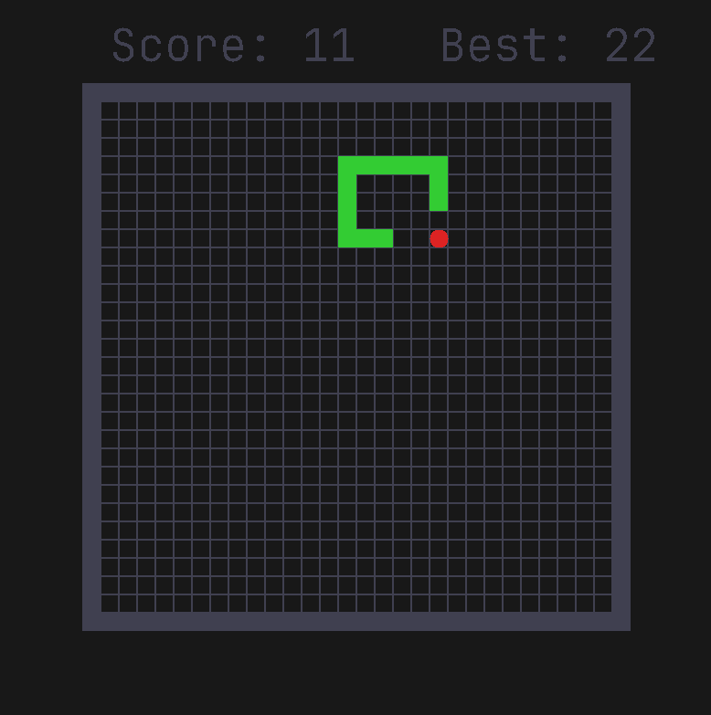

# Snake

A simple implementation of the classic Snake game using C and SDL2.  
My first game in C and my first interaction with a graphics library.

Try it in the browser: https://gillesramstein.github.io/Snake/

*Todo:* Use reinforcement learning to teach an AI to play the game.

Credits for the font:
https://www.jetbrains.com/lp/mono/
